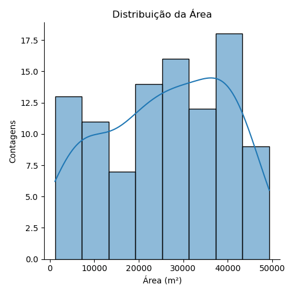
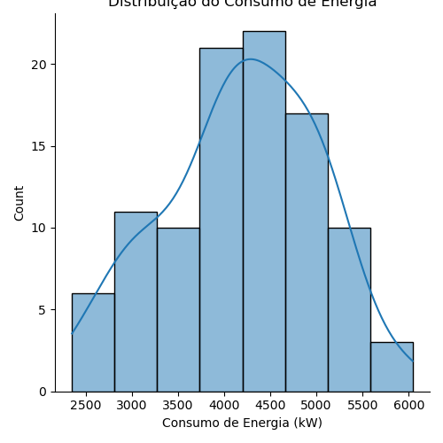

# Estudo sobre Regressão Linear
_Neste projeto, exploro a regressão linear simples como forma de compreender e modelar a relação entre duas variáveis, focando na previsão do consumo de energia de estabelecimentos a partir da área construída. Apresento a base teórica do modelo, incluindo sua formulação matemática e aplicação pelo método de gradiente descendente. Para a parte prática, desenvolvi um código próprio em Python e comparei seus resultados com a biblioteca Scikit-learn._

## Introdução
A regressão linear é um modelo matemático que descreve a relação entre duas (ou mais) variáveis. A partir desse modelo, é possível prever o valor de uma variável a partir da outra, pois pressupõe-se que elas possuem uma relação linear entre si. Isso pode ser descrito de acordo com a seguinte equação matemática:

$$ y(x) = a_0 + a_1 x_1 + a_2 x_2 + ... + a_n x_n $$

Em que y é a variável dependente e x é a variável independente. Os valores de a são os coeficientes da função, que definem a inclinação da reta e onde ela corta o eixo y.

Neste projeto, meu objetivo é explorar a regressão linear simples, que busca entender a relação entre uma variável independente e uma variável dependente, ajustando uma reta que melhor representa essa relação. Diferentemente da regressão linear múltipla, que utiliza duas ou mais variáveis independentes para prever a variável dependente, a regressão linear simples trabalha com apenas uma variável explicativa, tornando o modelo mais direto e fácil de interpretar.

$$ y(x) = a_0 + a_1 x_1 $$

É importante ressaltar que a regressão linear indica apenas a correlação entre as variáveis utilizadas, mas não implica relação causal.

Para encontrar os coeficientes que melhor se ajustam aos dados, o modelo de regressão linear simples utiliza o método dos mínimos quadrados. Ou seja, ele procura minimizar a diferença entre o valor de y proposto pelo modelo e o valor de y real. Isso é feito a partir da minimização do valor da função custo J:

$$ J(a) = \frac{1}{m} \sum^m _{i=1} (h(x_i) - y_i )^2 $$

Essa minimização é feita através do algoritmo de gradiente descendente, que funciona da seguinte forma: um primeiro valor de “a” é fornecido, a partir dele, um novo valor para “a” é calculado por meio da expressão:

$$ a_j = a_j - \alpha \frac{\partial J(a)}{\partial a_j}  $$

Substituindo o valor da derivada da função custo (calculada no apêndice A), chegamos a seguinte expressão para a determinação do valor de "a":

$$ a_j = a_j - \frac{2 \alpha}{m}(h(x_i)-y)x_j $$

## Exemplo Prático com Dados
Para entender o funcionamento da regressão linear simples, escrevi um código implementando o algoritmo da forma mais simples e detalhada possível. Além disso, comparei os resultados do meu código com a implementação do modelo através da biblioteca Scikit-learn, que é uma das ferramentas mais utilizadas em Python para tarefas de machine learning.

Para treinar e testar os modelos, utilizei um dataset do Kaggle pensado para o estudo de regressão linear. Os dados do dataset podem ser usados para predizer o consumo de energia de estabelecimentos baseado em algumas características. Neste estudo, irei focar na relação entre o consumo de energia e a área do estabelecimento.

O dataset possui um dataframe de treino e um de teste. O dataframe de treino possui as seguintes informações:

* Building type: tipo de estabelecimento (residencial, industrial ou outro);
* Square footage: metragem do estabelecimento;
* Number of occupants: número de ocupantes do estabelecimento;
* Appliances used: número de aparelhos utilizados;
* Average temperature: temperatura média do edifício em Celsius;
* Day of week: dia da semana;
* Energy consumption: consumo de energia em kW.

Uma análise inicial do dataframe mostrou que não haviam linhas duplicadas ou valores nulos. Foi apenas necessário ajustar os tipos das colunas do dataframe.

```
# summary of columns, data types and null values
print(train_data.info())

# check for duplicated rows
print('duplicated rows:', train_data.duplicated().sum())

# data type correction
train_data['Building Type'] = train_data['Building Type'].astype('string')
train_data['Day of Week'] = train_data['Day of Week'].astype('string')
```

Antes de aplicar a regressão linear aos dados, é necessário normalizá-los. Esse processo é essencial ao se utilizar modelos baseados em gradiente descendente como a Regressão Linear, pois aumenta a acurácia do modelo. A normalização transforma a escala dos dados de forma que todos os valores se encontrem em um intervalo de 0 a 1. Garantindo que o modelo utilizado não distorça a relação entre as variáveis, caso interprete que uma delas tem maior importância devido a uma escala maior, por exemplo.

A normalização pode ser utilizada quando a distribuição dos dados não é Gaussiana e os dados usados possuem escalas distintas. A equação utilizada para normalizar os dados é a seguinte:

$$ x_{normalizado} = \frac{x-x_{min}}{x_{max}-x_{min}} $$

Nas figuras abaixo, mostro o histograma das duas variáveis de interesse deste estudo. Comparando o eixo $x$ de ambos os gráficos, é possível ver a diferença de escala entre a área e o consumo de energia.

<div style="text-align: center;">
    
    
</div>

Para normalizar os dados, defini a função ```normalize_data```:
```
def normalize_data(arr):
  array_normalized = []
  for item in arr:
    valor_normalized = (item - arr.min()) / (arr.max() - arr.min())
    array_normalized.append(valor_normalized)
  return array_normalized
```

Além disso, defini a função linear (também chamada de hipótese) e a função custo ```f_cost```:

```
# linear function
def hipotesis(coef_0, coef_1, x):
  return coef_0 + coef_1 * x

# cost function
def f_cost(arr, coef_0, coef_1, y):
  sum = 0
  m = len(arr)
  for i in range(len(arr)):
    sum += (hipotesis(coef_0, coef_1, arr[i]) - y[i])**2
  return (1/m) * sum
```
Para aplicar a regressão linear nos dados normalizados, defini a função ```linear_regression```, que itera sobre os valores da função custo ```f_cost``` para encontrar os valores dos coeficientes $a_0$ e $a_1$ que a minimizam. Além disso, a função retorna o resíduo:

```
def linear_regression(x_norm, y_norm, alpha=0.01, a_0=0, a_1=0):
  contador = 1
  J = 0
  J_arr = []
  a_0_arr = []
  a_1_arr = []
  residuo_arr = []

  while contador >= 0.00001:
    # calculate cost function and update contador
    J = f_cost(x_norm, a_0, a_1, y_norm)
    J_arr.append(J)

    # calculate the gradient
    soma_0 = 0
    soma_1 = 0
    for i in range(len(x_norm)):
      soma_0 += (hipotesis(a_0, a_1, x_norm[i]) - y_norm[i])
      soma_1 += (hipotesis(a_0, a_1, x_norm[i]) - y_norm[i]) * x_norm[i]
    gradiente_0 = soma_0 / len(x_norm)
    gradiente_1 = soma_1 / len(x_norm)

    # calculate the new value for the coefficients
    a_0 = a_0 - alpha * gradiente_0
    a_1 = a_1 - alpha * gradiente_1

    # add the coefficients in an array
    a_0_arr.append(a_0)
    a_1_arr.append(a_1)

    # calculate new cost function and update
    J_new = f_cost(x_norm, a_0, a_1, y_norm)
    contador = J - J_new
    J = J_new

  # calculando o residuo
  for i in range(len(x_norm)):
    residuo = y_norm[i] - hipotesis(a_0, a_1, x_norm[i])
    residuo_arr.append(residuo)

  return a_0, a_1, a_0_arr, a_1_arr, residuo_arr, J_arr
```
Após essas etapas é importante "desnormalizar" os dados para poder vê-los na escala original. O cálculo para encontrar a equação de "desnormalização" está detalhado no Apêndice B.

```
# de-normalize the coeficients after the linear regression
def denormalizer(x, y, coef_0, coef_1):
  deltay = y.max() - y.min()
  deltax = x.max() - x.min()
  coef0_desn = (deltay/deltax) * coef_1 * x.min() + (coef_0 * deltay) + y.min()
  coef1_desn = (deltay/deltax) * coef_1
  return coef0_desn, coef0_desn
```

## Apêndice A: Derivada Parcial da Função Custo

$$ \frac{\partial J(a)}{\partial a_j}=\frac{\partial }{\partial a_j}\left[ \frac{1}{m}\sum_{i=1}^{m}(h(x_i)-y)^2 \right] $$

$$ \frac{\partial J(a)}{\partial a_j}=\frac{2}{m}(h(x_i)-y)\cdot \frac{\partial }{\partial a_j}\left[ \sum_{i=1}^{m}(h(x_i)-y) \right] $$

$$ \frac{\partial J(a)}{\partial a_j}=\frac{2}{m}(h(x_i)-y)\cdot \frac{\partial }{\partial a_j}\left[ a_0+a_1x_1 +...+a_mx_m-y \right] $$

$$ \frac{\partial J(a)}{\partial a_j}=\frac{2}{m}(h(x_i)-y)x_j $$

## Apêndice B: "Desnormalização"
Partindo dos valor normalizados de $x’$ e $y’$:

$$ x'=\frac{x-x_{min}}{x_{max}-x_{min}} $$ 

$$ y'=\frac{y-y_{min}}{y_{max}-y_{min}} $$

Isolando $y$, temos: $ y=y'(y_{max}-y_{min})+y_{min} $

A equação da reta retornada pelo modelo é: 

$$y'=a_1'x'+a_0'$$

Substituindo no valor de $y’$: 

$$ y=(a_1'x'+a_0')(y_{max}-y_{min})+y_{min} $$

Agora, substituindo o valor de $x'$ :

$$ y=\left ( a_1'\left ( \frac{x-x_{min}}{x_{max-x_{min}}} \right )+a_0' \right )(y_{max}-y_{min})+y_{min} $$

Organizando os valores conseguimos chegar na transformação inversa para os coeficientes da reta:

$$ y=\left ( \frac{a_1'x}{x_{max}-x_{min}}-\frac{a_1'x_{min}}{x_{max}-x_{min}}+a_0' \right )(y_{max}-y_{min})+y_{min} $$

Multiplicando:

$$ y=\left [ \frac{(y_{max}-y_{min})}{x_{max}-x_{min}}\cdot a_1'x-\frac{(y_{max}-y_{min})}{x_{max}-x_{min}}\cdot a_1'x_{min}+a_0' \right ]+y_{min}$$


$$ y=\left [ \frac{(y_{max}-y_{min})a_1'}{x_{max}-x_{min}}\right ]\cdot x+\left [ -\frac{(y_{max}-y_{min})a_1'}{x_{max}-x_{min}}\right ]\cdot x_{min}+a_0' +y_{min}$$


$$ y=\left [ \frac{(y_{max}-y_{min})a_1'}{x_{max}-x_{min}}\right ]\cdot x+\left [ \left ( -\frac{(y_{max}-y_{min})a_1'}{x_{max}-x_{min}} \right )\cdot x_{min}+a_0' +y_{min} \right ] $$


De forma que:

$$ y=\underbrace{ \left [ \frac{(y_{max}-y_{min})a_1'}{x_{max}-x_{min}}\right ]}_{a_1} \cdot x+\underbrace{\left [ \left ( -\frac{(y_{max}-y_{min})a_1'}{x_{max}-x_{min}} \right )\cdot x_{min}+a_0' +y_{min} \right ]}_{a_0} $$


Assim, encontramos as expressões para desnormalizar os valores dos coeficientes:

$$ a_1=\left ( \frac{y_{max}-y_{min}}{x_{max}-x_{min}} \right )a_1' $$

$$a_0=\left ( \frac{(y_{max}-y_{min})\cdot a_1'}{x_{max}-x_{min}} \right )x_{min}+a_0'(y_{max}-y_{min})+y_{min}$$ 


## Referências
* Statlab | [Regressão Linear e Logística](https://thiagovidotto.com.br/statlab/)
* EBAC | [Regressão Linear: teoria e exemplos](https://ebaconline.com.br/blog/regressao-linear-seo)
* IBM | [O que é Regressão Linear?](https://www.ibm.com/br-pt/think/topics/linear-regression)
* Stanford | [CS229: Machine Learning - Linear Regression and Gradient Descent](https://www.youtube.com/watch?v=4b4MUYve_U8)
* Kaggle | [Energy Consumption Dataset](https://www.kaggle.com/datasets/govindaramsriram/energy-consumption-dataset-linear-regression/data)
* Medium | [Understanding the Cost Function in Linear Regression for Machine Learning Beginners](https://medium.com/@yennhi95zz/3-understanding-the-cost-function-in-linear-regression-for-machine-learning-beginners-ec9edeecbdde)
* Stack Overflow | [Rescaling after feature scaling, linear regression](https://stackoverflow.com/questions/21168844/rescaling-after-feature-scaling-linear-regression?utm_source=chatgpt.com)
* Geeks For Geeks | [When to normalize data in regression?](https://www.geeksforgeeks.org/machine-learning/when-to-normalize-data-in-regression/)
* Medium | [A importância da normalização e padronização dos dados em Machine Learning](https://medium.com/ipnet-growth-partner/padronizacao-normalizacao-dados-machine-learning-f8f29246c12)

